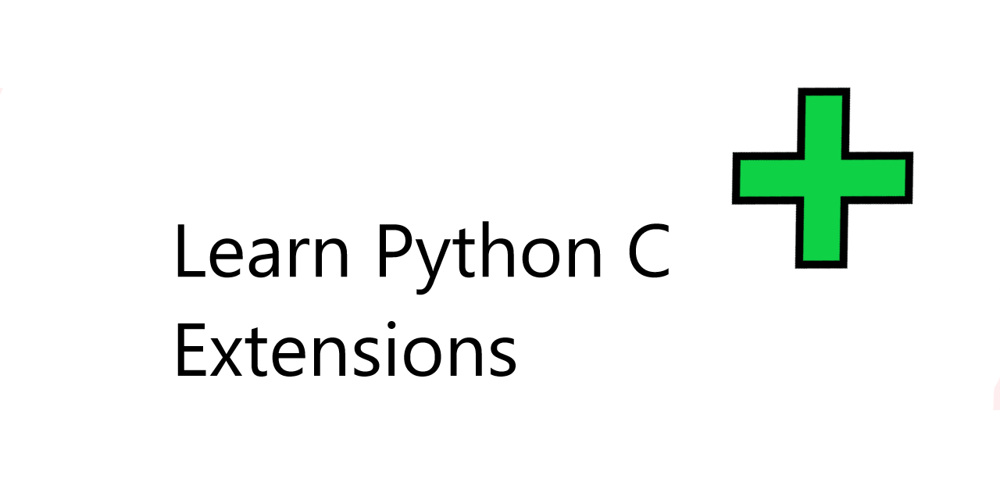

# PyCExtension




## Intro

Python is one of the world's most popular programming languages. C is a super fast, older language
that inspired the syntax and protocols of many languages in use today. They are both powerful languages,
but using them together brings unparalleled performance and simplicity to the playing field.

This is a guide to learn how to write, build, and ship Python C Extensions. It assumes some programming experinece
with both Python and `C`. At the end of this guide, you will be able to make a small extension module that can process
small values as input like this:

```py
>>> import DemoPackage
>>> DemoPackage.print_message("hello!")
printer hello!
```

The repo also serves as a template for starting Python C extension packages. It has the entire setup
to build and develop a C extension you can publish to the Python package index.

### Why make a C Extension?

C extesnions are fast, performant python libraries that can serve several purposes. Those include:

#### `High Performance`: 

C extensions can perform hundreds of times faster than equivalent code written in Python. 
This is because c functions are natively compiled, and just a thin layer over assembly code. Additionally, some
tasks can be slower to perform in Python, such as string processing. Python has no concept of a character, just strings of different lengths.
While C, has a very raw and effecient string composed purely of a block of memory terminated with a `\0` character. Overall,
C extensions provide a way to gain a powerhouse of performance in Python.

#### `Wrapping`:

Lots of widely used software libraries are written in C. However, many application level systems, like web development
framewroks, or mobile development frameworks, are written in languages like Java or Python. C functions can't be
called directly from Python, because Python does not understand C types without converting them to Python types. 
However, extensions can be used to wrap C code to make it callable from Python. The building and parsing of Python
types will be explained later.

